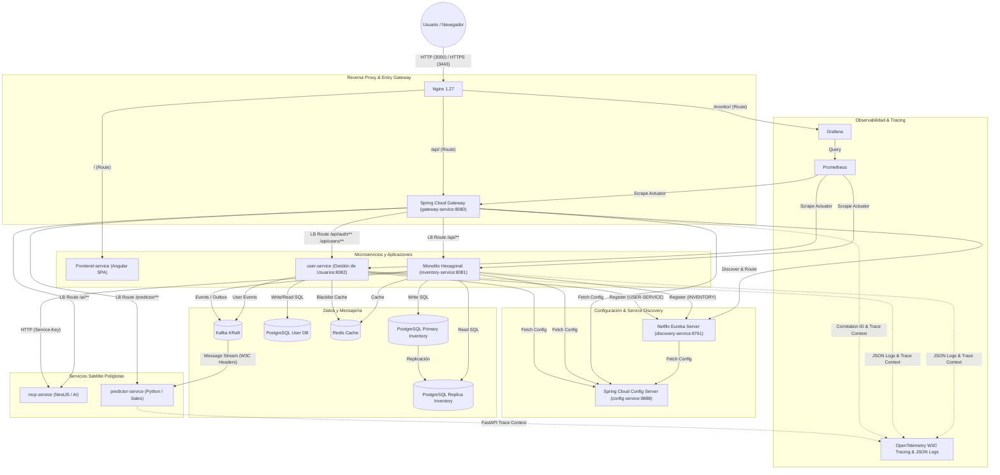

# Smart Economato Backend

Plataforma de gestión de inventario para escuelas culinarias que automatiza el control de stock, costeo de recetas, aprovisionamiento y planificación semanal de menús. Integra un asistente de IA conversacional y predicción de demanda mediante series temporales.

Proyecto final de Grado Superior DAW desarrollado en equipo de 4 personas (nov. 2025 – may. 2026). Mención honorífica en expediente académico.

> **Decisión de diseño consciente:** la arquitectura está intencionadamente sobredimensionada para el caso de uso real. Cada patrón elegido (Hexagonal, CQRS, Kafka, MCP) tiene una justificación técnica y documenta cómo se aplica en un contexto cohesionado. Es un ejercicio de arquitectura, no de productividad mínima.

Encontrarás la documentación en [Google Drive](https://drive.google.com/drive/folders/1BKIk5exbKpMgT00KgKLYW_baRUo81oRp).

[!IMPORTANT]

Este proyecto requiere [Smart Economato Frontend](https://github.com/user-ijavieh/smart-economato).

## Arquitectura

El sistema se basa en un **monolito modular con arquitectura hexagonal** (Ports & Adapters) como núcleo central (`inventory-service`), complementado por **servicios satélite políglotas** para capacidades que requieren ecosistemas específicos.

Dentro del `inventory-service`, los casos de uso complejos siguen el **patrón Facade**: cada servicio de aplicación delega responsabilidades específicas en sub-servicios especializados (`*Calculator`, `*Processor`, `*Manager`, `*Recorder`, `*Guard`, `*Policy`), lo que mantiene cada clase con una única responsabilidad y facilita el testing unitario.



### Servicios

| Servicio | Tecnología | Puerto interno | Descripción |
|---|---|---|---|
| **config-service** | Spring Cloud Config Server, Java 21 | `8888` | **Config Server centralizado**: Repositorio de configuración YAML único para todos los microservicios en bootstrap. |
| **gateway-service** | Spring Cloud Gateway, Java 21 | `8080` | **API Gateway reactivo (WebFlux)**: Enrutamiento dinámico guiado por Eureka, agregador OpenAPI/Swagger UI y propagación de `X-Correlation-ID`. |
| **discovery-service** | Spring Cloud Netflix Eureka, Java 21 | `8761` | **Service Discovery Server**: Registro y descubrimiento de microservicios. |
| **user-service** | Spring Boot 4.0, Java 25 | `8082` | **Microservicio de Usuarios (Fase 3)**: Dominio de usuarios, autenticación JWT, API Keys, registro de actividad y eventos Kafka. |
| **inventory-service** | Spring Boot 4.0, Java 25 | `8081` | **Core Inventario (Monolito Modular)**: Inventario, pedidos, recetas, alérgenos, ledger inmutable, blockchain. |
| **mcp-service** | NestJS 11, TypeScript | `3000` | **Servicio satélite**: Agente IA (Model Context Protocol) — OpenAI, Anthropic, Google, etc. |
| **predictor-service** | FastAPI, Python, Prophet | `8000` | **Servicio satélite**: Predicción de demanda basada en Kafka streams y series temporales. |
| **frontend-service** | Angular + Nginx | `80` | SPA del cliente -> [Smart Economato Frontend](https://github.com/user-ijavieh/smart-economato) |
| **reverse-proxy** | Nginx 1.27 | `80/443` | Terminación SSL, balanceo de entrada y enrutamiento hacia el API Gateway. |
| **postgres-user** | PostgreSQL 16 Alpine | `5435` | Base de datos aislada para `user-service` (`user_service`). |
| **postgres** | PostgreSQL 16 Alpine | `5432` | Base de datos primaria de inventario — **Catálogo cargado (1.165 productos)**. |
| **postgres-replica** | PostgreSQL 16 Alpine | `5433` | Réplica de lectura (CQRS) |
| **redis** | Redis 7 Alpine | `6379` | Caché, blacklist JWT |
| **kafka** | Confluent Kafka 7.6 (KRaft) | `9092` | Mensajería event-driven, auditoría |
| **prometheus** | Prometheus 2.51 | `9090` | Recolección de métricas de rendimiento |
| **grafana** | Grafana 10.4 | `3000` | Dashboards de monitorización unificada |

## Requisitos previos

- **Docker Desktop** (con Docker Compose v2)
- **4 GB de RAM libre** mínimo (8 GB recomendado)
- **10 GB de espacio en disco** libre
- **PowerShell 5.1+** (Windows) para el script de instalación

## Instalación y despliegue

1- Clona el repositorio [Smart Economato Frontend](https://github.com/user-ijavieh/smart-economato) y ubica el contenido en el directorio /frontend-service.

2- El proyecto incluye un **panel de control interactivo** (`install.ps1`) que automatiza toda la configuración:

```powershell
# Ejecutar como Administrador
.\install.ps1
```

El script realiza automáticamente:

1. **Verificación de hardware** (RAM, disco)
2. **Generación del archivo `.env`** con secretos criptográficamente seguros (JWT, HMAC, contraseñas de BD)
3. **Creación de certificados SSL** autofirmados
4. **Creación de volúmenes Docker** persistentes
5. **Configuración DNS local** (`smart-economato` en `/etc/hosts`)
6. **Despliegue de todos los contenedores** con `docker compose up`
7. **Carga del catálogo inicial** de productos (primer despliegue)
8. **Registro de tarea programada** en Windows Task Scheduler para arranque automático

### Despliegue manual (sin script)

```bash
# 1. Crear archivo .env con las variables requeridas (ver sección Variables de Entorno)
cp .env.example .env

# 2. Crear volúmenes externos
docker volume create turing-backend_postgres-data
docker volume create turing-backend_postgres-replica-data
docker volume create turing-backend_redis-data
docker volume create turing-backend_kafka-data
docker volume create turing-backend_prometheus-data
docker volume create turing-backend_grafana-data
docker volume create turing-backend_predictor-outbox-data
docker volume create turing-backend_uploads-data

# 3. Levantar servicios
docker compose -p smart-economato-api up -d --build
```

## Variables de entorno

El archivo `.env` en la raíz del proyecto debe contener:

| Variable | Descripción | Ejemplo |
|---|---|---|
| `POSTGRES_DB` | Nombre de la base de datos | `inventory` |
| `POSTGRES_USER` | Usuario de PostgreSQL | `inventory_user` |
| `POSTGRES_PASSWORD` | Contraseña de PostgreSQL | *(generada automáticamente)* |
| `JWT_SECRET` | Clave secreta para tokens JWT (128 chars) | *(generada automáticamente)* |
| `JWT_EXPIRATION` | Expiración del JWT en ms | `86400000` (24h) |
| `LEDGER_HMAC_SECRET` | Clave HMAC para integridad del ledger | *(generada automáticamente)* |
| `SEED_ADMIN_NAME` | Nombre del administrador inicial | `Admin` |
| `SEED_ADMIN_USER` | Usuario del administrador inicial | `admin` |
| `SEED_ADMIN_PASSWORD` | Contraseña del administrador inicial | `admin123` |
| `AI_NEST_SERVICE_KEY` | Clave de comunicación inter-servicio con MCP | *(generada automáticamente)* |
| `AI_NEST_ALLOWED_ORIGIN` | Origen permitido para CORS del servicio IA | `https://localhost` |
| `GRAFANA_USER` | Usuario de Grafana | *(mismo que admin)* |
| `GRAFANA_PASSWORD` | Contraseña de Grafana | *(misma que admin)* |
| `PROXY_HTTP_PORT` | Puerto HTTP del proxy | `3000` |
| `PROXY_HTTPS_PORT` | Puerto HTTPS del proxy | `3443` |

## Estructura del proyecto

```
smart-economato-API/
├── inventory-service/          # Monolito modular (Spring Boot 4.0 / Java 25)
│   └── src/main/java/com/economato/inventory/
│       ├── domain/model/          # Núcleo: entidades de dominio puras
│       ├── application/           # Puertos: casos de uso, DTOs, mappers
│       │   ├── usecase/
│       │   │   ├── *Service.java      # Facades: orquestan sub-servicios
│       │   │   ├── *Calculator.java   # Lógica de cálculo y coste
│       │   │   ├── *Processor.java    # Ejecución y reversión de operaciones
│       │   │   ├── *Manager.java      # Gestión de workflows y transiciones
│       │   │   ├── *Recorder.java     # Registro en ledger inmutable
│       │   │   ├── *Guard.java        # Validaciones de dominio (SKU, unicidad)
│       │   │   └── *Policy.java       # Políticas de acceso y reglas de negocio
│       │   ├── dto/
│       │   └── mapper/
│       └── infrastructure/        # Adaptadores
│           └── adapter/
│               ├── in/web/        # Driving: controladores REST
│               ├── in/messaging/  # Driving: consumidores Kafka
│               ├── out/persistence/ # Driven: repositorios JPA
│               ├── out/external/    # Driven: clientes HTTP
│               └── out/messaging/   # Driven: productores Kafka
├── mcp-service/                # Agente IA - Model Context Protocol (NestJS)
├── predictor-service/          # Predicción de demanda (FastAPI + Prophet)
├── nginx/                      # Configuración del reverse proxy
│   ├── reverse-proxy.conf      # Config Nginx para desarrollo
│   ├── reverse-proxy.template  # Template con variables de entorno
│   └── certs/                  # Certificados SSL (generados automáticamente)
├── grafana/                    # Provisioning de dashboards Grafana
├── docker-compose.yml          # Orquestación de todos los servicios
├── install.ps1                 # Panel de control e instalador (PowerShell)
├── reset.ps1                   # Script de reset del entorno
├── postgres-init.sh            # Inicialización de replicación PostgreSQL
├── productos.sql               # Catálogo inicial de productos
├── prometheus.yml              # Configuración de scraping de métricas
├── pg_hba.conf                 # Reglas de autenticación PostgreSQL
└── pom.xml                     # POM padre (Maven multi-módulo)
```

## Funcionalidades principales

### Gestión de inventario
- CRUD de productos con control de lotes y fechas de caducidad (FEFO)
- Trazabilidad completa con **ledger inmutable** protegido por HMAC
- **Verificación de integridad por hash chain** (`LedgerChainVerificationService`) con complejidad O(N)
- **Blockchain** para sellado de bloques de movimientos de stock

### Recetas y planificación
- Gestión de recetas con ingredientes, costes y alérgenos
- Planificación semanal de menús con reserva automática de stock
- Generación de **informes PDF** (iText 8)

### Pedidos y aprovisionamiento
- Gestión de órdenes de compra
- Alertas automáticas de stock bajo

### Asistente de IA ("Chef Pio")
- Chat conversacional con soporte multi-proveedor: OpenAI, Anthropic, Google, DeepSeek, Grok, Groq
- **Semantic Memory Graph (SMG)** para compresión inteligente de contexto
- Detección de intenciones (stock, pedidos, recetas, costes, alérgenos, crisis)
- Streaming SSE en tiempo real
- Rate limiting configurable por usuario

### Predicción de demanda
- Series temporales con **Facebook Prophet**
- Comunicación event-driven vía Kafka
- Outbox persistente en SQLite

### Seguridad
- **JWT con blacklist en Redis** — revocación activa de tokens sin necesidad de sesiones server-side; si Redis cae, la blacklist hace failover automático a PostgreSQL
- **AI Vault** — las API keys de proveedores IA (OpenAI, Anthropic, etc.) se cifran con AES en BD, nunca se exponen en texto plano
- **X-Service-Key para comunicación inter-servicio** — autenticación de servicio a servicio sin depender del JWT de usuario
- **Circuit breakers (Resilience4j)** — degradación graceful ante fallos de DB, Redis, Kafka y el servicio MCP; el sistema continúa operativo en modo reducido (ver sección Resiliencia)
- **RBAC con 3 roles** (`ADMIN`, `CHEF`, `STUDENT`) implementado a nivel de endpoint y reflejado en la UI

### Observabilidad y Trazado Distribuido (Fase 2)
- **Trazado Distribuido OpenTelemetry (W3C)** — Propagación automática de contextos `traceparent` a través de HTTP endpoints y encabezados de mensajes en Apache Kafka.
- **Logs Estructurados en Formato JSON** — Emisión de registros de log de una sola línea enriquecidos con `trace_id`, `span_id` y `correlation_id` en todos los microservicios (`gateway-service`, `inventory-service`, `predictor-service`, `mcp-service`).
- **Correlación de Negocio (`X-Correlation-ID`)** — Generación y propagación del encabezado de correlación desde el API Gateway a través de MDC en el backend y servicios políglotas.
- **Métricas Prometheus** (JVM, HikariCP, Kafka, memoria, caché Redis).
- **Dashboards Grafana** para la monitorización centralizada.
- **WebSockets** para alertas y notificaciones en tiempo real.

## Documentación de la API

Con el sistema en ejecución, la documentación interactiva está disponible en:

| Herramienta | URL |
|---|---|
| **Scalar** | `https://localhost/scalar/` |

## Panel de control (`install.ps1`)

El script ofrece un menú interactivo con las siguientes opciones:

- **Configurar sistema** — Inicialización completa (primera vez)
- **Encender** — `docker compose up -d --build --wait`
- **Apagar** — `docker compose down`
- **Reiniciar** — `docker compose restart`
- **Diagnóstico** — Health checks, logs recientes, auto-reparación
- **Limpieza profunda** — Prune de imágenes y caché Docker
- **Backup/Restore** — Exportar e importar volúmenes Docker como `.tar.gz`

## Tests

```bash
# Tests unitarios
cd inventory-service
mvn test
```

El proyecto usa:
- **JUnit 5** + **Mockito** para tests unitarios
- **Testcontainers** (PostgreSQL, Kafka, Redis) para tests de integración
- **JaCoCo** para cobertura de código
- **pytest** para el predictor-service

## Stack tecnológico

| Capa | Tecnología |
|---|---|
| Backend principal | Spring Boot 4.0, Java 25, Virtual Threads |
| Agente IA | NestJS 11, TypeScript, OpenAI SDK, Anthropic SDK |
| Predicción | FastAPI, Prophet, Pandas |
| Base de datos | PostgreSQL 16 (Primary + Replica) |
| Caché | Redis 7 |
| Mensajería | Apache Kafka (KRaft, sin Zookeeper) |
| Reverse Proxy | Nginx 1.27 |
| Monitorización | Prometheus + Grafana |
| Seguridad | Spring Security, JWT (jjwt), Resilience4j |
| Documentación API | SpringDoc OpenAPI + Scalar |
| PDF/Excel | iText 8, Apache POI 5.3 |
| Mapping | MapStruct 1.6 |
| Contenedores | Docker Compose |

## Licencia

Este proyecto se distribuye bajo la licencia **Creative Commons Attribution-NonCommercial-ShareAlike 4.0 International (CC BY-NC-SA 4.0)**.

Esto significa que puedes:
- **Compartir:** Copiar y redistribuir el material en cualquier medio o formato.
- **Adaptar:** Remezclar, transformar y construir sobre el material.

Bajo las siguientes condiciones:
- **Atribución:** Debe otorgar el crédito correspondiente y proporcionar un enlace a la licencia.
- **No Comercial:** No puede utilizar el material con fines comerciales sin permiso previo.
- **Compartir Igual:** Si remezcla, transforma o crea a partir del material, debe distribuir sus contribuciones bajo la misma licencia que el original.

Para usos comerciales, por favor contacta con el autor.
